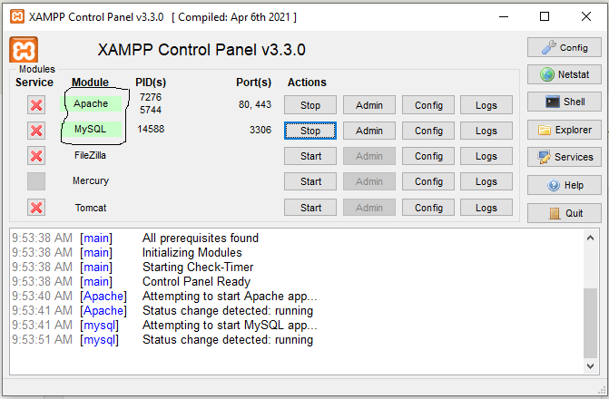
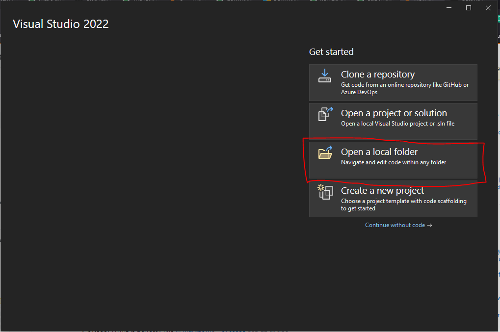
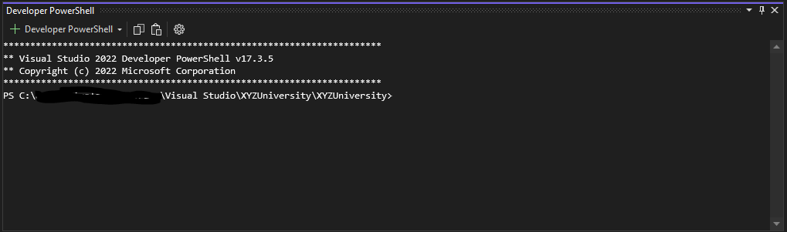
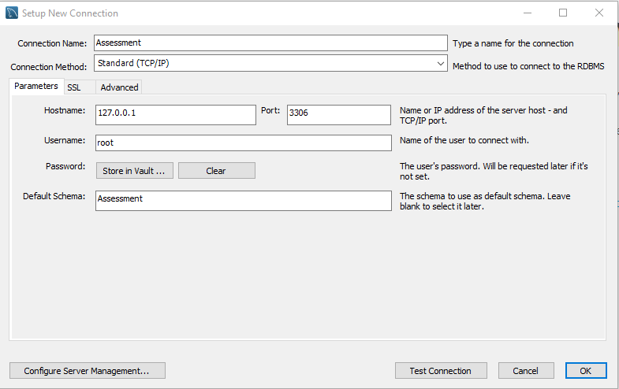
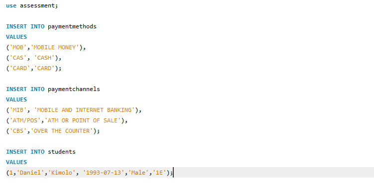
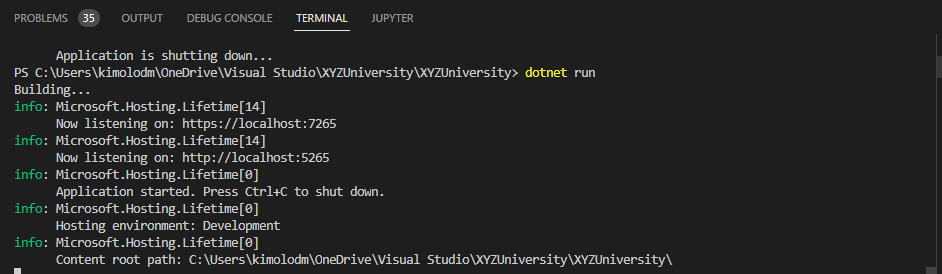
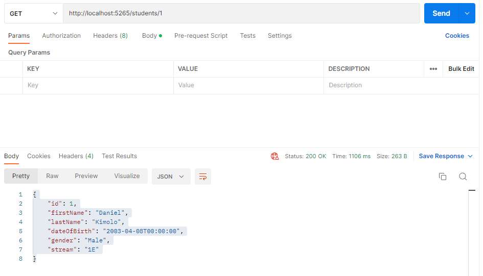
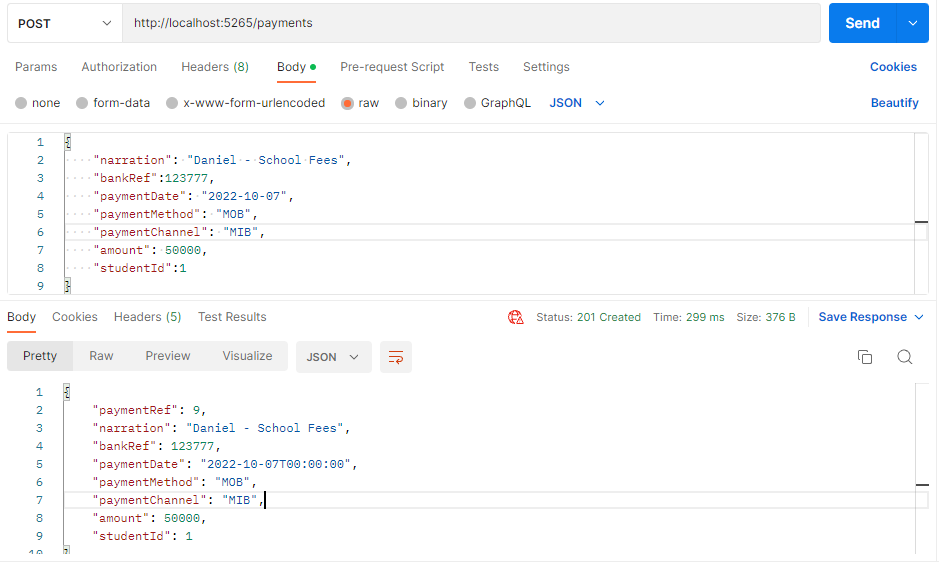
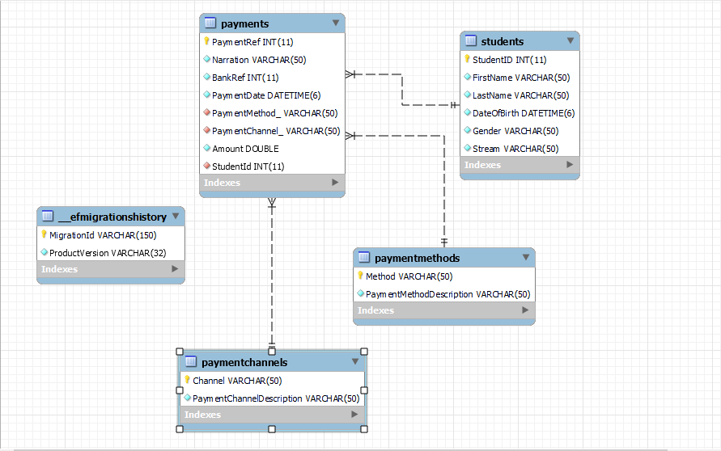

# XYZ University - Family Bank Payments API

- [How to Configure the Project](#confp)
  - [Install Visual Studio 2022](#visual-studio)
  - [Install MySQL](#mysql)
  - [Open Project Using Visual Studio](#open-project)
  - [Install MySQL Workbench](#mysql-workbench)
  - [Run Project Using Visual Studio 2022](#run-project)

- [Deliverables](#deliverables)
  - [Simple Working API](#simple-working-api)
  - [Payment and Student Repositories](#payment-student-repositories)

- [Students](#students)
  - [Create Student](#create-student)
    - [Create Student Request](#create-student-request)
    - [Create Student Response](#create-student-response)
  - [Get Student](#get-student)
    - [Get Student Request](#get-student-request)
    - [Get Student Response](#get-student-response)
  - [Update Student](#update-student)
    - [Update Student Request](#update-student-request)
    - [Update Student Response](#update-student-response)
  - [Delete Student](#delete-student)
    - [Delete Student Request](#delete-student-request)
    - [Delete Student Response](#delete-student-response)

- [Payments](#payments-api)
  - [Create Payment](#create-payment)
    - [Create Payment Request](#create-payment-request)
    - [Create Payment Response](#create-payment-response)
  - [Get Payment](#get-payment)
    - [Get Payment Request](#get-payment-request)
    - [Get Payment Response](#get-payment-response)
  - [Update Payment](#update-payment)
    - [Update Payment Request](#update-payment-request)
    - [Update Payment Response](#update-payment-response)
  - [Delete Payment](#delete-payment)
    - [Delete Payment Request](#delete-payment-request)
    - [Delete Payment Response](#delete-payment-response)

## How to Configure the Project
### Install Visual Studio 2022
Install Visual Studio 2022 Community which contains the .NET 6 Framework.

Download Link: https://visualstudio.microsoft.com/downloads/

### Install MySQL
Install XAMPP 
Download Link: https://www.apachefriends.org/download.html

After Installing Start the Apache Server and MySQL



### Open Project Using Visual Studio 2022


After the project opens, open up a terminal and run the following commands:



```js
dotnet tool install --global dotnet-ef
dotnet add package Microsoft.EntityFrameworkCore
dotnet add package Microsoft.EntityFrameworkCore.Design
dotnet ef database update
```
### Install MySQL Workbench and Run Preparation Scripts
Install MySQL Workbench so that we can run the Preparation Scripts.

Download Link: https://dev.mysql.com/downloads/workbench/

Once it is installed, open MySQL Workbench connect to Schema assessment and login



Run the Preparation Scripts found in the Docs Folder named "Preparattion_Script.sql"



### Run Project Using Visual Studio 2022

Go back to Visual Studio, on the terminal, run the following commands:



```js
dotnet restore
dotnet build
dotnet run
```

## Deliverables
### Simple Working API
#### Validate Student

```js
GET /students/{{id}}
```

#### Get Student Response

```js
200 Ok
```

```json
{
    "id": 1,
    "firstName": "Daniel",
    "lastName": "Kimolo",
    "dateOfBirth": "2003-04-08T00:00:00",
    "gender": "Male",
    "stream": "1E"
}
```


#### Post Payment Notification

```js
POST /payments
```

```json
{
    "narration": "Daniel - School Fees",
    "bankRef":123777,
    "paymentDate": "2022-10-07",
    "paymentMethod": "MOB",
    "paymentChannel": "MIB",
    "amount": 50000,
    "studentId":1
}
```

#### Create Payment Response

```js
201 Created
```

```yml
Location: {{host}}/payments/{{paymentRef}}
```

```json
{
    "paymentRef": 9,
    "narration": "Daniel - School Fees",
    "bankRef": 123777,
    "paymentDate": "2022-10-07T00:00:00",
    "paymentMethod": "MOB",
    "paymentChannel": "MIB",
    "amount": 50000,
    "studentId": 1
}
```



### Payment and Student Repositories
You can find the complete ERD Diagram under XYZUniversity/XYZUniversity/Docs with the name "ERDDiagram.mwb". Open the file with MySQL Workbench.




## More Endpoints

### Create Student Request

```js
POST /students
```

```json
{
    "firstName": "Dollar",
    "lastName": "Kimolo",
    "dateOfBirth": "2003-04-08",
    "gender": "Female",
    "stream": "1E"
}
```

### Create Student Response

```js
201 Created
```

```yml
Location: {{host}}/Students/{{id}}
```

```json
{
    "id": 3,
    "firstName": "Dollar",
    "lastName": "Kimolo",
    "dateOfBirth": "2003-04-08T00:00:00",
    "gender": "Female",
    "stream": "1E"
}
```

## Get Student

### Get Student Request

```js
GET /students/{{id}}
```

### Get Student Response

```js
200 Ok
```

```json
{
    "id": 3,
    "firstName": "Dollar",
    "lastName": "Kimolo",
    "dateOfBirth": "2003-04-08T00:00:00",
    "gender": "Female",
    "stream": "1E"
}
```

## Update Student

### Update Student Request

```js
PUT /students/{{id}}
```

```json
{
    "firstName": "Doris",
    "lastName": "Kimolo",
    "dateOfBirth": "2003-04-08",
    "gender": "Female",
    "stream": "1E"
}
```

### Update Student Response

```js
204 No Content
```

or

```js
201 Created
```

```yml
Location: {{host}}/students/{{id}}
```

## Delete Student

### Delete Student Request

```js
DELETE /students/{{id}}
```

### Delete Student Response

```js
204 No Content
```

## Create Payment

### Create Payment Request

```js
POST /payments
```

```json
{
    "narration": "Danielel - School Fees",
    "bankRef":9,
    "paymentDate": "2022-10-07",
    "paymentMethod": "MOB",
    "paymentChannel": "MIB",
    "amount": 50000,
    "studentId":"1"
}
```

### Create Payment Response

```js
201 Created
```

```yml
Location: {{host}}/payments/{{paymentRef}}
```

```json
{
    "paymentRef": 8,
    "narration": "Danielel - School Fees",
    "bankRef": 9,
    "paymentDate": "2022-10-07T00:00:00",
    "paymentMethod": "MOB",
    "paymentChannel": "MIB",
    "amount": 50000,
    "studentId": 1
}
```

## Get Payment

### Get Payment Request

```js
GET /payments/{{paymentRef}}
```

### Get Payment Response

```js
200 Ok
```

```json
{
    "paymentRef": 8,
    "narration": "Danielel - School Fees",
    "bankRef": 9,
    "paymentDate": "2022-10-07T00:00:00",
    "paymentMethod": "MOB",
    "paymentChannel": "MIB",
    "amount": 50000,
    "studentId": 1
}
```

## Update Payment

### Update Payment Request

```js
PUT /payments/{{paymentRef}}
```

```json
{
    "narration": "Daniel - School Fees",
    "bankRef":10,
    "paymentDate": "2022-10-05",
    "paymentMethod": "MOB",
    "paymentChannel": "MIB",
    "amount": 5000,
    "studentId":"2"
}
```

### Update Payment Response

```js
204 No Content
```

or

```js
201 Created
```

```yml
Location: {{host}}/payments/{{paymentRef}}
```

## Delete Payment

### Delete Payment Request

```js
DELETE /payments/{{paymentRef}}
```

### Delete Payment Response

```js
204 No Content
```
